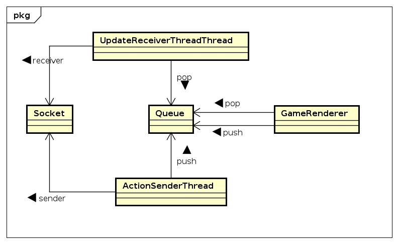
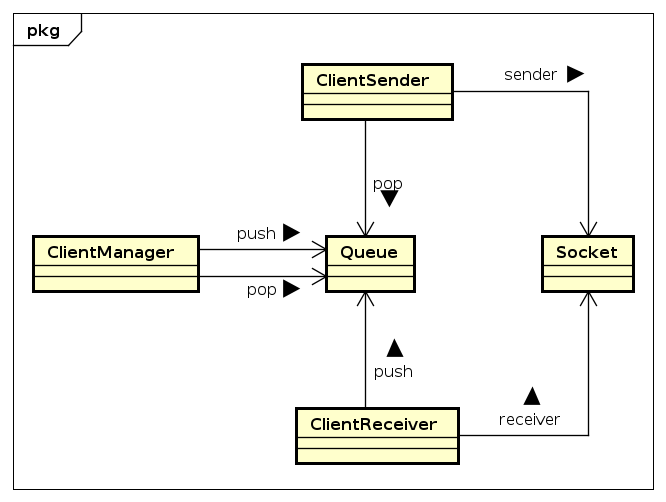
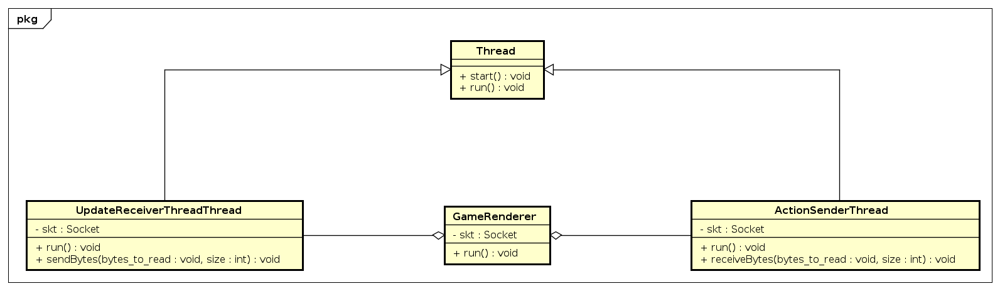
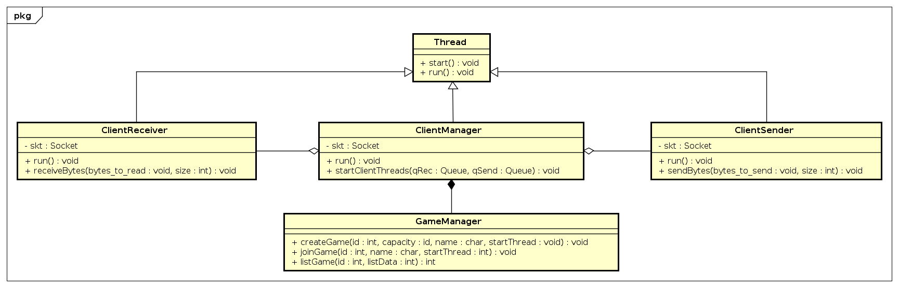
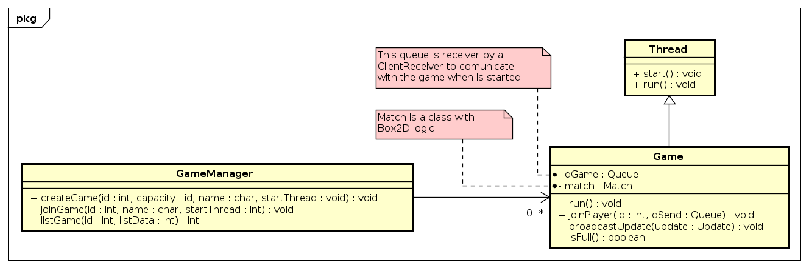

# RocketLeague Code Documentation

## Targets
* `./client_main <host> <port>` run the client
* `./server_main <port>` run the server
* `./testClient` run test client
* `./testServer`run test server
* `./testCommon` run test common
## Communication Protocol
* ### Communication
  - The protocol used maintains a communication through bytes. 

  - We have two separate protocols for the client and the server.

  - The deserialization of the data in the client is given with Actions and the server with Updates.
    Serialization consists of passing these objects to strips of bytes.

* ### Design
  - In both cases we use the [double dispatch](https://refactoring.guru/es/design-patterns/visitor-double-dispatch) pattern as code modeling.
  - Generating objects with low coupling and high cohesion

## Diagrams
### Object Diagrams
With the object diagrams we seek to visualize the
communication given between the threads of the project.
#### Threads
In the case of the client, we observe that the communication between the receiver
and sender threads takes place through a shared queue, which has the purpose of
being a monitor between the displayed classes.  

We also see the participation of the socket which allows communication between the client and the server.

Just like the client, the server communicates in a similar way.

### Class Diagrams
#### Client Class
We observe three main classes in the client.
* **GameRenderer**: contains and executes the SDL and QT binding.

  GameRenderer through its GUI sends the ActionSenderThread
  what the user has communicated, and receive updates
  via Update Receiver Thread.
* **ActionSenderThread** : Sends through the socket to the
  server the data of the actions received.
* **UpdateReceiverThread** : Receives the data via the socket and
  returns it in something understandable by the GameRenderer.
  

#### Server Class
* **ClientManager**: start the threads
* **ClientSender** : sends through the socket to the
  server the data of the actions received.
* **ClientReceiver** : receives the data via the socket and
  returns it in something understandable by the Game.
* **GameManager** : contains the games, which maintain communications with the threads.
  

The games are threads.

They communicate directly with the server threads
(sender and receiver) simulating direct communication between the player and the game

