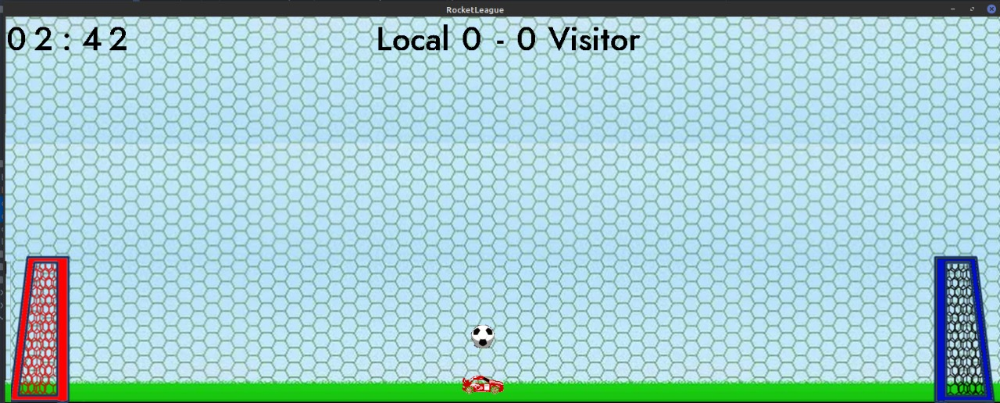

# RocketLeague Manual Game
[Go Back](README.md)
## Let go to play!

### Commands

|   Command   |    Key    | 
|:-----------:|:---------:|
|  Move Left  |     A     |
| Move Right  |     D     | 
|    Jump     |     W     | 
| Double Jump |   W + W   | 
|  Flip Left  | W + W + A |
| Flip Right  | W + W + D |

#### Step One

Enter your name to get started.

#### Step Two

Creates a match. Wait for another client to connect.

#### Step Three
Choose the name and capacity of the game.

#### Step Four

Start the game with another client. Join existing game.

#### Step Five

Enjoy the game with your friends 😃

